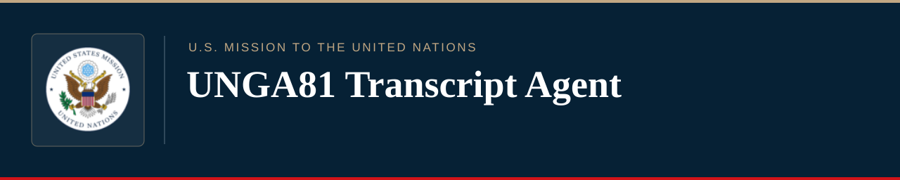

<p align="center">
  
</p>

<p align="center">
  <a href="un/ui/START_HERE.md"></a>
  <a href="un/ui/START_HERE.md"></a>
  <a href="docs/BROWSER_ANALYSIS.md"></a>
  <a href="site/release.json"></a>
  <a href="docs/LATENT_COMPARISON.md"></a>
  <a href="research/README.md"></a>
</p>

<p align="center">
  <a href="docs/BROWSER_ANALYSIS.md"></a>
  <a href="docs/LSA_COMPARISON.md"></a>
  <a href="docs/PARTITION_METHODS.md"></a>
  <a href="docs/HDBSCAN.md"></a>
  <a href="docs/NMF.md"></a>
  <a href="docs/DISPLAY_AUDIT.md"></a>
</p>

<p align="center">
  <a href="https://lystadjs.github.io/un/transcript-agent/"><strong>Open report builder</strong></a>
  &nbsp;&middot;&nbsp;
  <a href="https://lystadjs.github.io/un/transcript-agent/latent.html">Compare latent structure</a>
  &nbsp;&middot;&nbsp;
  <a href="#local-r--shiny-workflow">Install locally</a>
</p>

## Purpose

On its _https://transcripts.un.org/en_ website, the United Nations has built a comprehensive repository for address and meeting transcripts created by using automatic speech recognition.  These transcripts preserve what diplomatic officials _said_, but this does not necessarily correlate to what deserves the most attention.  **The UNGA81 Transcript Agent transforms open-source meeting records into source-based evidence for diplomatic readouts, comparative text analysis, and nonrandom latent information discovery.**  Users can examine a single meeting or a range of proceedings, follow recurring issues, compare language across speakers and regions, and reference the passages behind each result.  

**The governing rule for this project is simple: an analytical claim should remain connected to its source, its denominator, and its limitations.**

## Nonrandom Latent Information Discovery

_Unsupervised machine learning_ offers a unique approach to the task of learning from data.  Unsupervised learning allows data to speak for itself, where no expected outcomes or pre-existing bias can railroad analysis into pre-defined labeling values.  ......

## Choose a workflow

| Workflow | Use it for | Entry point |
| --- | --- | --- |
| **Browser report builder** | Collect published transcripts on demand; analyze a meeting, topic, date range, or region; export visual reports and evidence. No installation or external AI API required. | [Open workspace](https://lystadjs.github.io/un/transcript-agent/) |
| **Latent-structure comparison** | Reopen saved runs; compare PCA/LSA, clustering, and component settings; inspect reviewed excerpts against their parent speeches. | [Open comparison](https://lystadjs.github.io/un/transcript-agent/latent.html) |
| **Local R / Shiny briefing** | Run the controlled D1 analysis, set tracked issues, review the five-slot briefing, and save an unsent Outlook draft. | [Local setup](un/ui/START_HERE.md) |

## Browser workflow — no installation

1. Open the [report builder](https://lystadjs.github.io/un/transcript-agent/). Choose **One individual meeting** to search the UN's date-specific meeting inventory, or choose a date range and meeting scope for broader analysis.
2. Select the meeting, dates, and any speaker-region restrictions. **Leave Topic blank** to analyze all eligible passages; enter a topic and related phrases to narrow the evidence. A missing match is not proof that an issue was absent.
3. Select the available descriptive, clustering, or component methods, then choose **Generate report**. The report records collection coverage, source links, excluded or unavailable material, and the settings used.
4. Inspect the source passages before drawing conclusions. Download the standalone HTML report, transcript and analysis JSON, or evidence CSV; use the browser's print function to save a PDF.

The browser requests inventory and transcript records from [transcripts.un.org](https://transcripts.un.org/en). Date and public source requests reach the UN service; topic filtering and numerical analysis run on the user's device. There is no account, hosted model endpoint, scheduled collection, or automatic email send. The [collection and method guide](docs/BROWSER_ANALYSIS.md) records source, language, resource, and export limits. The [individual-meeting guide](docs/INDIVIDUAL_MEETINGS.md) explains the date-first selector and its source checks.

## Local R & Shiny workflow

For the Windows briefing application, install **R 4.3 or newer** and use a short checkout path to avoid Windows extraction and model-filename limits. From PowerShell:

```powershell
git clone https://github.com/LystadJS/UNGA81-Transcript-Agent.git
cd UNGA81-Transcript-Agent\un\ui
.\Setup.bat
.\Verify.bat
.\Start.bat
```

Choose **Use the installed pipeline**, enter a reporting date, and add up to 20 issues to track. Generate the readout, examine the evidence and coverage, then save the **unsent** `.eml`, HTML, plaintext, or audit archive (and PDF when a compatible renderer is available). User-defined topics retrieve candidate passages; they do not alter the frozen corpus or automatically classify national positions. Use [the local UI guide](un/ui/START_HERE.md) for interface modes and [the D1 setup guide](un/START_HERE.md) for command-line runs and dependency controls.

## How it works

```text
UN transcript inventory + published source records
                     |
           Source identity and provenance
                     |
    Date / meeting / language / region selection
                     |
      Exact-text deduplication + topic matching
                     |
        Descriptive and optional exploratory
              text-analysis methods
                     |
      Coverage + diagnostics + source passages
                     |
     Visual HTML / JSON / CSV / printable report
             (local R also: EML draft)
```

**Collection and interpretation remain separate operations.** The collector records which meetings and transcript segments were available; eligibility rules and deduplication determine what enters each analysis; methods describe that retained text. Reports preserve the source links, selection settings, and missing-data accounting needed to inspect a result rather than treating the chart as the evidence.

### Implemented method layers

| Layer | What is available | Interpretive boundary |
| --- | --- | --- |
| **Descriptive browser analysis** | Frequencies by date and speaker region, passage lengths, TF-IDF, and cosine similarity. | Counts and lexical resemblance describe observed text, not support or opposition. |
| **Exploratory browser analysis** | PCA or LSA; k-means, PAM, hierarchical clustering, HDBSCAN, and Gaussian mixtures; NMF components; UMAP and optional MDS displays; group-refit and sensitivity diagnostics. | Clusters, components, and distances have no automatic diplomatic labels. Noise, ambiguity, withheld fits, and population changes remain visible. |
| **Frozen R D1 pipeline** | Rule-based issue evidence, frozen TF-IDF, PCA/PCoA, clustering and network diagnostics; **12 executable adapters out of 42 registered methods**. | Daily publication gates remain separate from research diagnostics. An adapter's existence is not authority to publish its output. |

[Detailed method inventory](docs/INVENTORY.md) · [Latent comparison and saved-run contracts](docs/LATENT_COMPARISON.md) · [Research roadmap](docs/NEXT_STEPS.md)

## Outputs, review, and limitations

Browser reports can be exported as standalone HTML with linked source evidence, JSON containing settings and analytical results, and CSVs for retained passages and supported diagnostics. The local R workflow additionally assembles a USUN-themed Outlook draft, with predefined analytical slots and country readouts. **These outputs are drafts for inspection, not automatic judgments about countries or instructions to distribute a briefing.**

English transcript tracks may include interpretation or automatic transcription. Missing or late source records remain coverage gaps; an individual transcript segment is not necessarily a complete speech. Exact-text deduplication does not establish that near-duplicates are absent. A small or dependent set of meetings cannot support claims of independent replication merely because it contains many passages.

**Research status (8 October 2026):** the lexical/semantic, country-name, agenda, and speaker-attribution controls are development-stage diagnostics. Production-shaped collection tests use synthetic responses. The **37 reserved held-out meeting transcripts remain unopened**, and no substantive alignment, stance, or forecasting model has been authorized for release by these tests. See [development controls](docs/DEVELOPMENT_CONTROLS.md), [synthetic acceptance](docs/PRODUCTION_SHAPED_ACCEPTANCE.md), and [roster-adapter verification](docs/ROSTER_ADAPTER_PUBLICATION.md).

## Repository guide

| Path | Contents |
| --- | --- |
| [`site/`](site/) | Browser collector, local numerical analysis, report builder, and comparison workspace |
| [`un/`](un/) | R analytical pipeline, Shiny UI, email templates, configuration, and frozen policies |
| [`research/`](research/) | Development-only text, representation, and evaluation methods with explicit validation boundaries |
| [`docs/`](docs/) | Method contracts, operating guides, acceptance records, and research roadmap |
| [`reports/`](reports/) · [`examples/`](examples/) | Evidence-oriented examples and historical reports |

The browser release is recorded in [`site/release.json`](site/release.json) (**1.12.1** at this revision); the saved-run comparison engine is **1.1.0**. For reproducible local checks, start with [`REPRODUCE.md`](REPRODUCE.md). Historical acceptance records are labeled by their original run and should not be mistaken for a new full-system test.

<sub>Public reports are analytical aids. Verify quotations, transcription, speaker attribution, coverage, and conclusions against the linked UN records before citing or circulating findings.</sub>
