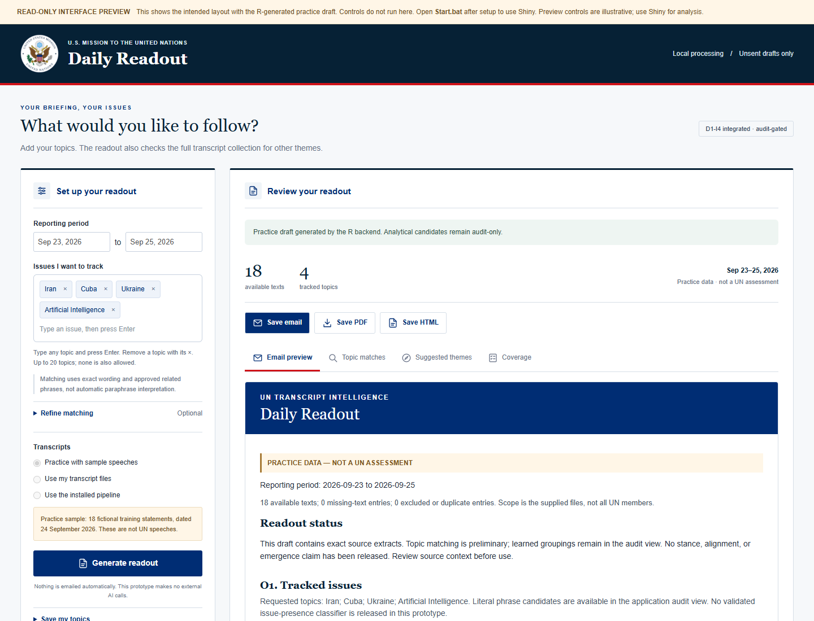

# UNGA81 Transcript Agent

Integrated UN transcript analysis and Shiny readout interface, with the USUN
executive email theme and Windows-friendly package paths.

**[Open the remote browser workspace](https://lystadjs.github.io/un/transcript-agent/)**
to collect live UN transcripts by topic, dates and speaker region, run selectable
descriptive methods, download visual reports, and review assigned packets without
local installation. See the [report builder guide](docs/BROWSER_ANALYSIS.md).
The selectable text-cluster workflow uses PCA or LSA representation, k-means on those
scores, and a separate UMAP display with source links and exported diagnostics.
Compare both representations on the same passages, including cluster membership
and neighborhood preservation. See the [PCA/LSA comparison guide](docs/LSA_COMPARISON.md).
Optional grouped resampling refits TF-IDF, the chosen representation and k-means, then reports cluster
stability, consensus pair coverage and passages to inspect. See the
[stability guide and implementation sequence](docs/CLUSTER_STABILITY.md).
Packet text stays in the browser; completed reviews are returned as files for
validated import. See the [remote workspace guide](docs/REMOTE_WORKSPACE.md).

## Start on Windows

Clone or extract this repository into a short location such as `C:\work\unga81`.
The application is in **un/**. Keep this path short for the saved model files.

1. Install R 4.3 or later.
2. Open `un/ui/Setup.bat` to install the interface's declared dependencies.
3. Open `un/ui/Start.bat` to launch the local Shiny interface.
4. Choose dates and topics, generate a readout, inspect the evidence, and save an unsent draft.

For the full D1 pipeline setup, use [un/START_HERE.md](un/START_HERE.md).
The [UI guide](un/ui/START_HERE.md) explains input modes and setup.
The [read-only preview](un/ui/Interface%20Preview.html) is included for local viewing.

## Current capabilities and methods

The [HLW Cuba review](reports/hlw-cuba/README.md) collects the 21–28 September
2026 public transcript inventory and runs the existing upload workflow with
Cuba, embargo and adjacent-topic refinements. It includes coverage gaps and
source-linked candidate evidence; it does not release a stance model.
The [HLW recovery supplement](reports/hlw-cuba/RECOVERY.md) prioritizes the 41
empty broader-HLW transcript pages, preserving published statements, captions,
and clearly labeled video transcription drafts with separate provenance.

The [single-reviewer AI pilot](docs/REVIEW_PILOT.md) includes a local review form,
the selected Google BERT checkpoint, a reviewed-label loader and a post-run
audit attachment. Saving labels does not publish model predictions.

Open the [visual review example](examples/review/index.html) locally for the
actual unsent readout, four audit charts and appearance controls. See the
[dataset-building guide](docs/DATA_GUIDE.md) for the reviewed-data workflow.

The [Research work](research/README.md) adds 29 tested standalone engineering
kernels toward the 30-method daily-adapter backlog; driftmapR (M26) remains unresolved. These
prototypes are not daily adapters and accept synthetic engineering inputs only.
Daily D1 implementation remains at 12 adapters. The optional review-workspace
tools use Python 3.11+; the daily pipeline remains R-native.

See the [repository inventory](docs/INVENTORY.md) for the three input workflows,
all 42 registered methods, the 12 executable adapters, and current limitations.

The historical [I5 extension and remaining roadmap](docs/I5.md) describes the six new
audit-only methods and its original 30-method backlog. See [I8](research/I8.md) for current progress and recommended next steps.

## Included

- Native R D1-I5 analytical pipeline, publication gates, and exactly five email outputs.
- Shiny interface with editable topics, source evidence, coverage, and draft exports.
- USUN seal, navy/red palette, and local outline icons.
- Replay fixtures, frozen model/reference artifacts, inherited validation and tests.
- [Path mapping and extraction notes](un/PATHS.md) and current file checksums.

## Validation status

Current regression and Shiny server checks are recorded in
[I5 acceptance](un/validation/i5/README.md).

Earlier import validation: Windows ZIP extraction and checksums passed. All 62 R files parsed, all 9 Shiny
adapter checks passed, and all 2,567 checked saved-data references resolved.
The backend passed 96/97 checks; PDF creation failed because the local Python
launcher could not run. Desktop and mobile theme previews passed layout checks,
and the Shiny UI constructor rendered. The later I5 server tests passed after adding `zip` to the QA environment.
Full browser and native Outlook acceptance remain open.

See [packaging validation](docs/packaging.md) and [theme validation](un/ui/THEME.md).
Inherited acceptance records describe their original runs, not a new full
regression run for this repository import. No email is sent automatically.

## Reproduction and provenance

[REPRODUCE.md](REPRODUCE.md) describes this checkout. The imported baseline was the
short-path, themed `un-ui.zip` build; current source includes the I5 extension. Package checksums are preserved
in `un/SHA256SUMS.txt`; `.gitattributes` prevents checkout line-ending conversion
from invalidating them. Keep API keys and local runtime configuration out of Git.

Earlier repository documents are preserved in [docs/legacy](docs/legacy).
They describe earlier deliverables; this import does not include the separate
September 28 execution bundle mentioned in the old reproduction document.
